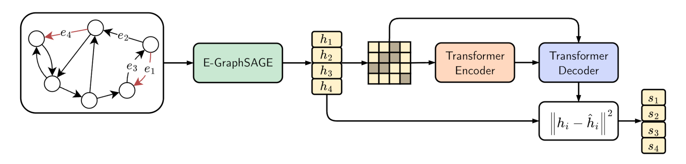

[](https://arxiv.org/abs/2509.16625) [](https://opensource.org/licenses/Apache-2.0)

# Self-Supervised Learning of Graph Representations for Network Intrusion Detection

<p align="center">
  
</p>

## Citation

```bibtex
@inproceedings{guerra2025selfsupervised,
  author = {Guerra, Lorenzo and Chapuis, Thomas and Duc, Guillaume and Mozharovskyi, Pavlo and Nguyen, Van-Tam},
  booktitle = {Advances in Neural Information Processing Systems},
  pages = {109471--109501},
  publisher = {Curran Associates, Inc.},
  title = {Self-Supervised Learning of Graph Representations for Network Intrusion Detection},
  url = {https://proceedings.neurips.cc/paper_files/paper/2025/file/9ddb13ae9150f99298065d889f951014-Paper-Conference.pdf},
  volume = {38},
  year = {2025}
}
```
